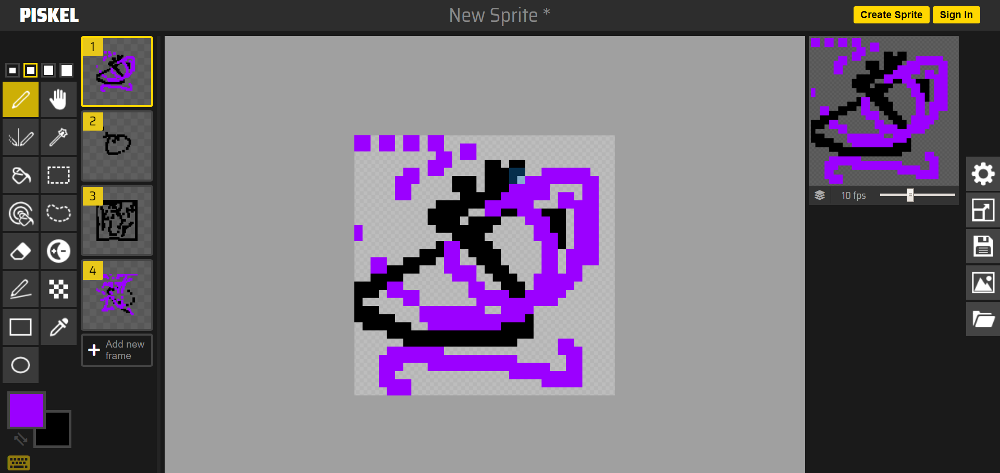
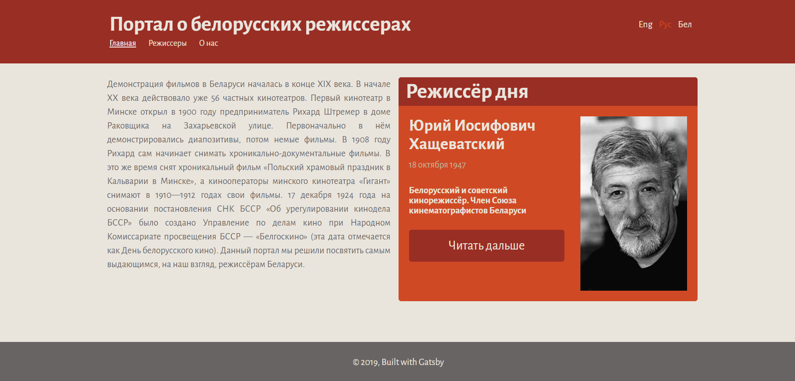
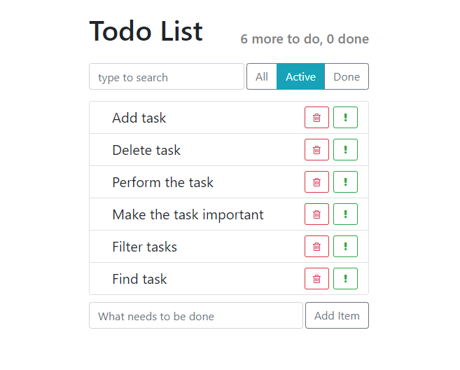

## FEE-Junior   
  
> **Responsive website using flex and grid technology, written in pure HTML and CSS + jQuery Slider**
>  
>
> - **[Link to repository](https://github.com/Stassras/FEE-Junior)**  

## Piskel-clone   
  
> **This is an application for creating animation and drawing. Written in pure JS, HTML and SASS.**
>  
>  
> - **[Link to repository](https://github.com/Stassras/Piskel-Clone)**  

## Culture-Portal   
  
> **A cultural portal about Belarusian directors made by a team with my friends. Made using React, gatsby, bootstrap and LESS.**  
>  
>  
> - **[Link to repository](https://github.com/Stassras/Culture-portal)**  

## Todo-list   
  
> **Simple TodoList developed on React and Bootstrap + ES6 / ES7**  
>  
>  
> - **[Link to repository](https://github.com/Stassras/Todo-list)**  
  
## Different test items from IT companies.  
  
> **Here you can see different applications on different technologies with different functionalities**  
>  
> - **[Test 1](https://github.com/Stassras/on-travel-test)**
> - **[Test 2](https://github.com/Stassras/softcorp-test)**
> - **[Test 3](https://github.com/Stassras/mr-test)**

