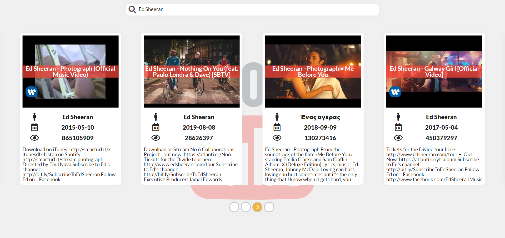
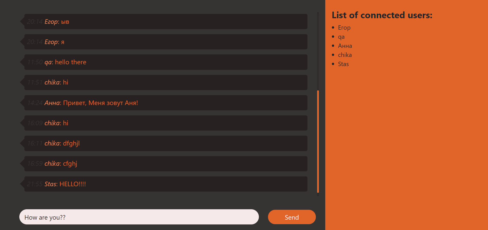

## FEE-Junior   
  
> **Responsive website using flex and grid technology, written in pure HTML and CSS + jQuery Slider**
>  
>
> - **[Link to repository](https://github.com/Stassras/FEE-Junior)**  

## Piskel-clone   
  
> **This is an application for creating animation and drawing. Written in pure JS, HTML and SASS.**
>  
>  
> - **[Link to repository](https://github.com/Stassras/Piskel-Clone)**  

## Culture-Portal   
  
> **A small cultural portal about Belarusian directors made by a team with my friends. Made using React, gatsby, bootstrap and LESS.**  
>  
>  
> - **[Link to repository](https://github.com/Stassras/Culture-portal)**  

## Youtube-search   
  
> **A simple example of a search engine on YouTube, using youtube API and pure JS**  
>  
>  
> - **[Link to repository](https://github.com/Stassras/Youtube-search)**  

## Simple-chat   
  
> **Simple chat made on react and bootstrap with WebSocket**  
>  
>  
> - **[Link to repository](https://github.com/Stassras/Simple-chat)**
